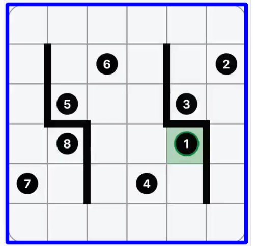
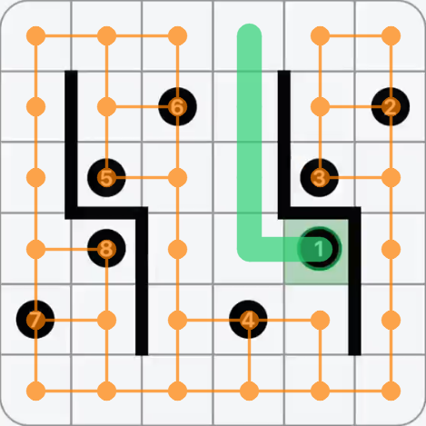

  

 

# LinkedIn's Zip Puzzle Solver

## About the puzzle 
This project provides an algorithm for solving LinkedIn's Zip puzzle game automatically. The puzzle is a visual logic game 
where you need to plot a path through a grid while passing through numbered checkpoints in order. 
A tutorial on how to play can be found [here](https://www.linkedin.com/games/zip/). 

## Preprocessing and Computer Vision
First, the grid and its elements must be located in a raw image. The puzzle elements to identify are checkpoint numbers and walls 
between cells. To this end, several image processing techniques are used, like thresholding, morphological transformations and 
optical character recognition. This step is done using the popular computer vision library OpenCV, as well as the ML package Scikit-learn, as seen in [zip_parser.py](src/zip_parser.py). 
Below is shown the preprocessing for a test example. 

|  |  |   |  |  
| :---: | :---: | :---: | :---: | 
| Original image | Detect and crop grid | Detect puzzle elements | Solution | 

## Backtracking and Graph Theory

Second, a solution is found from the parsed puzzle elements. Here, a backtracking strategy is used to search for possible paths that traverse the grid. To accept or reject 
candidate paths, the algorithm is aided by a graph data structure, exemplified below. This graph's vertices are given by the unvisited cells in the grid, and its edges are given by neighboring cells 
with no wall between them. A path is rejected whenever the degree of a vertex is less than 2 (except possibly the current vertex or the final checkpoint), or when the graph is disconnected. 
 

## Results
The solver was tested on 20 puzzles, ranging from puzzle No. 01 to 20. The mean solve time was 0.14s, while the maximum was 1.22s. Full results, with images, are available at [examples](examples). 
